# ⚽ Agenda de Futebol - Plataforma de Dados End-to-End

## 📌 Sobre o Projeto

Este projeto é uma **Agenda de Futebol** desenvolvido como portfólio de Engenharia de Dados. O objetivo principal é consolidar e visualizar informações sobre jogos de futebol — incluindo placares em tempo real, horários e estatísticas pós-rodada — através de uma arquitetura de dados robusta e escalável.

Embora o produto final seja um dashboard interativo, o foco central deste repositório é demonstrar a implementação de um pipeline de dados **End-to-End** completo, utilizando práticas modernas de **Data Lakehouse**, integração contínua (CI/CD) e Infraestrutura como Código (IaC).

### Acesso ao Dashboard: [Agenda Futebol Hoje](https://dados-futebol.streamlit.app/) 

## 🏗 Arquitetura da Solução

A solução foi arquitetada para garantir confiabilidade, escalabilidade e baixo acoplamento entre os componentes. O fluxo de dados segue o padrão de Data Lakehouse com camadas segregadas.

### Fluxo de Dados

1.  **Ingestão:** Scripts Python em containers Docker consomem dados da API-Football (RapidAPI) e depositam os arquivos brutos (JSON) diretamente no Data Lake.
2.  **Armazenamento (Data Lake S3):** O armazenamento é organizado na arquitetura Medalhão:
    *   **Bronze / Raw:** Dados crus conforme recebidos da API.
    *   **Silver / Cleaned:** Dados limpos, tipados e enriquecidos.
    *   **Gold / Aggregated:** Tabelas analíticas agregadas prontas para consumo de negócios.
3.  **Visualização:** Uma aplicação Streamlit consome diretamente a camada Gold. Otimizações de cache (TTL) são aplicadas para reduzir custos de requisição (S3 GETs) e latência.
4.  **Infraestrutura:** Todo o ambiente AWS (Buckets S3, IAM Roles, Lambda, Glue e EventBridge) é provisionado via Terraform.

### Diagrama de Arquitetura

## 🚀 Destaques Técnicos & Boas Práticas

Este projeto aplica padrões de mercado para garantir qualidade e manutenibilidade:

*   **Arquitetura Medalhão (Bronze/Silver/Gold):** Garante a rastreabilidade e a qualidade dos dados, permitindo reprocessamento sem perda de dados históricos.
*   **Infrastructure as Code (IaC):** Utilização do Terraform para provisionamento reprodutível e versionado da infraestrutura na AWS.
*   **Gerenciamento de Dependências Moderno:** Uso do `uv` para resolução rápida e determinística de pacotes Python.
*   **Segurança e Ambientes:** Configuração rigorosa de segredos utilizando variáveis de ambiente e distinção entre configurações locais (`secrets.toml`) e de produção (Cloud Secrets).
*   **Otimização de Performance:** Implementação de estratégias de *caching* no Streamlit para minimizar chamadas dispendiosas ao S3, otimizando custos e tempo de resposta.
*   **Containerização:** Uso de Docker para garantir consistência no ambiente de execução dos scripts de ETL.
* **GitHub Actions**: CI/CD individual para cada workflow.

---
*Este projeto foi desenvolvido com fins educacionais e de demonstração profissional.*
