# ⚽ Agenda de Futebol - Plataforma de Dados End-to-End


## 📌 Sobre o Projeto

Este projeto é uma **Agenda de Futebol** desenvolvido como portfólio de Engenharia de Dados. O objetivo principal é consolidar e visualizar informações sobre jogos de futebol — incluindo placares em tempo real, horários e estatísticas pós-rodada — através de uma arquitetura de dados robusta e escalável.

Embora o produto final seja um dashboard interativo, o foco central deste repositório é demonstrar a implementação de um pipeline de dados **End-to-End** completo, utilizando práticas modernas de **Data Lakehouse**, integração contínua (CI/CD) e Infraestrutura como Código (IaC).

### Acesso ao Dashboard: [Agenda Futebol Hoje](https://dados-futebol.streamlit.app/) 

## 🏗 Arquitetura da Solução

A solução foi arquitetada para garantir confiabilidade, escalabilidade e baixo acoplamento entre os componentes. O fluxo de dados segue o padrão de Data Lakehouse com camadas segregadas.

### Fluxo de Dados

1.  **Ingestão:** Scripts Python em containers Docker consomem dados da API-Football (RapidAPI) e depositam os arquivos brutos (JSON) diretamente no Data Lake.
2.  **Armazenamento (Data Lake S3):** O armazenamento é organizado na arquitetura Medalhão:
    *   **Bronze / Raw:** Dados crus conforme recebidos da API.
    *   **Silver / Cleaned:** Dados limpos, tipados e enriquecidos.
    *   **Gold / Aggregated:** Tabelas analíticas agregadas prontas para consumo de negócios.
3.  **Visualização:** Uma aplicação Streamlit consome diretamente a camada Gold. Otimizações de cache (TTL) são aplicadas para reduzir custos de requisição (S3 GETs) e latência.
4.  **Infraestrutura:** Todo o ambiente AWS (Buckets S3, IAM Roles, Lambda, Glue e EventBridge) é provisionado via Terraform.

### Diagrama de Arquitetura

```mermaid
graph TD
    %% Atores Externos
    API["API-Football (RapidAPI)"]
    User[Usuário Final]

    %% CI/CD (GitHub Actions)
    subgraph CI_CD [GitHub Actions Workflows]
        %% CORREÇÃO AQUI: Aspas adicionadas nos dois nós abaixo
        GH_Lambda["Deploy Lambda\n(Build & Push)"]
        GH_Glue["Deploy Glue\n(Upload Scripts)"]
    end

    %% Serviços AWS e Componentes
    subgraph AWS [Environment AWS]
        
        subgraph Config [Configuração & Imagens]
            SSM[SSM Parameter Store]
            ECR[Amazon ECR]
        end

        subgraph Ingestion ["Ingestão (Lambda)"]
            EB[EventBridge Schedule]
            Lambda["AWS Lambda Function\n(Docker Image)"]
        end

        subgraph Transformation ["Processamento (Glue)"]
            GlueTrig[Glue Trigger]
            Glue["AWS Glue Job\n(PySpark/Python)"]
        end

        subgraph DataLake [S3 Data Lakehouse]
            Scripts[Scripts Folder]
            Bronze[(Camada Bronze\nRaw JSON)]
            Silver[(Camada Silver\nCleaned Parquet)]
            Gold[(Camada Gold\nAggregated KPIs)]
        end
    end

    subgraph Visualization [Visualização]
        Streamlit[Streamlit Dashboard]
    end

    %% Fluxo de Deploy (CI/CD)
    GH_Lambda -->|Build & Push Image| ECR
    GH_Lambda -.->|Update Function Code| Lambda
    GH_Glue -->|Upload .py| Scripts

    %% Fluxo de Execução
    EB -->|1. Cron Trigger| Lambda
    SSM -.->|API Key| Lambda
    ECR -.->|Pull Image| Lambda
    
    Lambda -->|2. GET Request| API
    API -->|3. JSON Response| Lambda
    Lambda -->|4. Write Raw| Bronze

    %% CORREÇÃO ANTERIOR MANTIDA
    GlueTrig -->|"5. Cron Trigger (+15min)"| Glue
    Scripts -.->|Read Script| Glue
    
    Glue -->|6. Read| Bronze
    Glue -->|7. Transform| Silver
    Glue -->|8. Aggregate| Gold

    Streamlit -->|9. Read Cache| Gold
    Streamlit -->|10. Display| User
```



## 📂 Estrutura de Diretórios

A estrutura do projeto está organizada funcionalmente para separar infraestrutura, lógica de aplicação e scripts de dados.

```bash
.
├── dashboard/               # Aplicação de visualização (Streamlit)
│   ├── app.py              # Ponto de entrada do Dashboard
│   └── requirements.txt    # Dependências específicas do dashboard
├── Dockerfile               # Definição da imagem para o worker de ETL
├── etl_script.py            # Lógica de extração e transformação dos dados
├── main.py                  # Orquestrador local do pipeline
├── main.tf                  # Definição da infraestrutura AWS via Terraform
├── plano.md                 # Documentação de planejamento e backlog
├── pyproject.toml           # Configuração do projeto e ferramentas
├── mise.toml                # Configuração de ambiente e ferramentas
└── requirements.txt         # Dependências do "main.py"
```

## 🚀 Destaques Técnicos & Boas Práticas

Este projeto aplica padrões de mercado para garantir qualidade e manutenibilidade:

*   **Arquitetura Medalhão (Bronze/Silver/Gold):** Garante a rastreabilidade e a qualidade dos dados, permitindo reprocessamento sem perda de dados históricos.
*   **Infrastructure as Code (IaC):** Utilização do Terraform para provisionamento reprodutível e versionado da infraestrutura na AWS.
*   **Gerenciamento de Dependências Moderno:** Uso do `uv` para resolução rápida e determinística de pacotes Python.
*   **Segurança e Ambientes:** Configuração rigorosa de segredos utilizando variáveis de ambiente e distinção entre configurações locais (`secrets.toml`) e de produção (Cloud Secrets).
*   **Otimização de Performance:** Implementação de estratégias de *caching* no Streamlit para minimizar chamadas dispendiosas ao S3, otimizando custos e tempo de resposta.
*   **Containerização:** Uso de Docker para garantir consistência no ambiente de execução dos scripts de ETL.
* **GitHub Actions**: CI/CD individual para cada workflow.

---
*Este projeto foi desenvolvido com fins educacionais e de demonstração profissional.*
